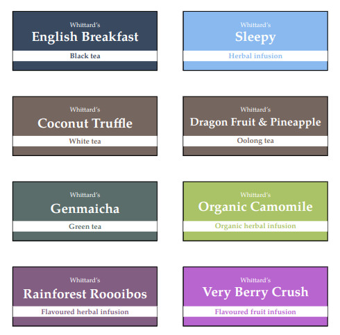

# tea-labels

Labels for my tins of tea, designed to fit in the Whittard's tins.

## Usage

```tex
\tinlabel{<name>}{<colour>}{<type>}{<brand>}
```

In the name, you may want to use `\large`, `\Large` etc in order to make the name fill the space.

### Colour options

```tex
\definecolor{blacktea}{HTML}{394960}
\definecolor{greentea}{HTML}{5a6d6b}
\definecolor{whitetea}{HTML}{75665f}
\definecolor{oolong}{HTML}{75665f}
\definecolor{flavouredinfusion}{HTML}{825e82}
\definecolor{organicherbalinfusion}{HTML}{abc367}
\definecolor{herbalinfusion}{HTML}{8ab9ef}
\definecolor{fruitinfusion}{HTML}{b865cf}
```

## Example

```tex
\tinlabel{\Large English Breakfast}{blacktea}{Black tea}{Whittard's}
\tinlabel{\Large Coconut Truffle}{whitetea}{White tea}{Whittard's}
\tinlabel{\Large Genmaicha}{greentea}{Green tea}{Whittard's}
\tinlabel{\Large Rainforest Roooibos}{flavouredinfusion}{Flavoured herbal infusion}{Whittard's}
\tinlabel{\Large Sleepy}{herbalinfusion}{Herbal infusion}{Whittard's}
\tinlabel{\large Dragon Fruit \& Pineapple}{oolong}{Oolong tea}{Whittard's}
\tinlabel{\Large Organic Camomile}{organicherbalinfusion}{Organic herbal infusion}{Whittard's}
\tinlabel{\Large Very Berry Crush}{fruitinfusion}{Flavoured fruit infusion}{Whittard's}
```

